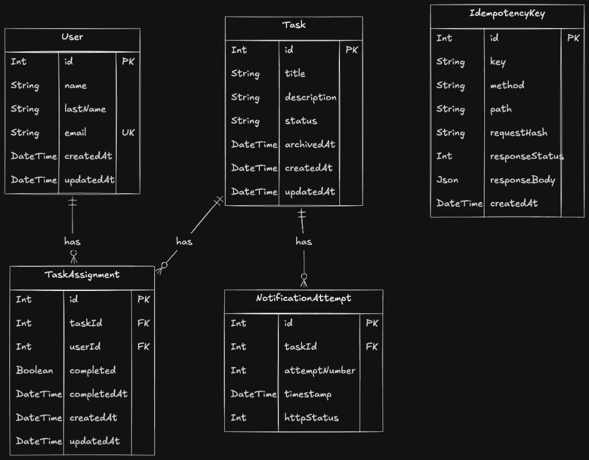

# Geest Reto — Task Management API

API REST para gestión de tareas con asignación multi-usuario, archivado automático, notificaciones confiables e idempotencia.

**Stack:** NestJS + TypeScript + Prisma + PostgreSQL (Railway)

### Diagrama ER



---

## Ejecutar en local

### Requisitos
- Node.js 20+
- PostgreSQL (puede ser Railway con Public Networking)

### Pasos

```bash
cp .env.example .env
# Completar DATABASE_URL, NOTIFY_URL, NOTIFY_SECRET, PORT

npm install
npx prisma migrate deploy
npm run start:dev
```

API por defecto: `http://localhost:7777` (según `PORT` en `.env`).

### Variables de entorno

| Variable | Uso |
|----------|-----|
| `DATABASE_URL` | Conexión PostgreSQL |
| `NOTIFY_URL` | Webhook externo al archivar una tarea |
| `NOTIFY_SECRET` | Secreto HMAC para firmar notificaciones (extra) |
| `PORT` | Puerto HTTP |

### Tests

```bash
npm test          # unit + e2e
npm run test:unit
npm run test:e2e
```

### Endpoints principales

| Método | Ruta |
|--------|------|
| POST | `/users` |
| GET | `/users` |
| GET | `/users/:idUser/tasks` |
| POST | `/tasks` |
| GET | `/tasks?status=open\|archived` |
| GET | `/tasks/:idTask` |
| POST | `/tasks/:idTask/assign` |
| POST | `/tasks/:idTask/complete` |
| GET | `/tasks/:idTask/notifications` |

Todos los `POST` aceptan header opcional `Idempotency-Key`.

Errores:

```json
{ "error": { "code": "...", "message": "..." } }
```

---

## Decisiones técnicas

1. **NestJS + Prisma + PostgreSQL**  
   Nest aporta estructura y testing; Prisma versiona el esquema en SQL (`prisma/migrations`); Postgres cumple el requisito de SQL real y escala mejor que SQLite para evaluación concurrente.

2. **Archivado concurrente**  
   Al completar, se usa transacción + `UPDATE ... WHERE status = 'open'`. Solo un request gana el archivado y dispara la notificación una vez.

3. **Idempotencia**  
   Interceptor global: reclama la clave en BD (`unique key+method+path`), ejecuta una sola vez y reutiliza la respuesta (incluye requests en paralelo).

4. **Notificaciones**  
   Hasta 3 intentos con backoff ante 5xx o timeout; cada intento se persiste y se consulta en `GET .../notifications`.

5. **Deploy (objetivo)**  
   API y Postgres en **Railway**: mismo proveedor, URL pública estable y costo bajo para mantener 7 días de evaluación.

---

## Extra — Firma HMAC de webhooks

Problema: un tercero podría falsificar POSTs a `NOTIFY_URL`.

Solución: firmar el body con HMAC-SHA256 y enviar:

```http
X-Geest-Signature: sha256=<hex>
```

usando `NOTIFY_SECRET`. El receptor recalcula la firma y valida autenticidad e integridad.

Por qué esta mejora (y no Swagger/paginación): refuerza la sección de **confiabilidad** del reto con una práctica de producción, sin cambiar los endpoints requeridos.

---

## Supuestos

- `Idempotency-Key` es **opcional**; si no viene, el POST se comporta normal.
- Misma key + body distinto → `409 IDEMPOTENCY_KEY_REUSE`.
- Email de usuario único; duplicado → `409 EMAIL_ALREADY_EXISTS`.
- Descripción de tarea opcional; título obligatorio.
- “Tareas pendientes” en `GET /users` = asignadas, no completadas por el usuario y con tarea `open`.
- Si no hay asignados, la tarea no se archiva sola.
- `NOTIFY_SECRET` ausente: se notifica igual, sin header de firma (con warning en logs).

---

## Recortes / fuera de alcance

- Auth/JWT y multi-tenant.
- Cola dedicada (Bull/SQS) para notificaciones (reintentos in-process bastan para el alcance).
- UI frontend.
- Soft-delete y auditoría extendida.

---

## API en producción

> Actualizar al desplegar.

- **URL:** _(pendiente — Railway)_  
- **Proveedor:** Railway (API + PostgreSQL)  
- **Motivo:** deploy simple, Postgres gestionado, adecuado para ventana de 7 días  
- **Health:** `GET /tasks` o crear un user de prueba  

Migraciones en deploy: `npx prisma migrate deploy` antes de `node dist/main`.
